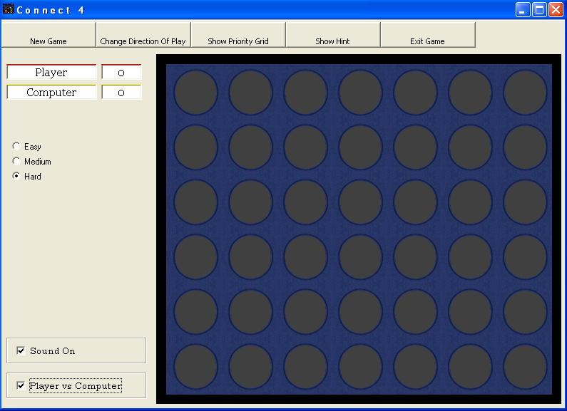



## Revised Connect 4

### Description

What can I say... I haven't seen any Connect 4 game with as many features as this one: 3 difficulty levels, falling pieces, sound, 2 player option(with an AI priority grid), a hint, and the option to change the direction of play(so that the pieces fall upwards). All my own work, check out the screenshot, comment - and vote if you like it.
 
### More Info
 
Might need to add the ImageList control from your components.

             |
---                |---
**Submitted On**   |2002-04-01 16:38:22
**By**             |[Jabba The Schmuck](https://github.com/Planet-Source-Code/PSCIndex/blob/master/ByAuthor/jabba-the-schmuck.md)
**Level**          |Advanced
**User Rating**    |5.0 (25 globes from 5 users)
**Compatibility**  |VB 6\.0
**Category**       |[Games](https://github.com/Planet-Source-Code/PSCIndex/blob/master/ByCategory/games__1-38.md)
**World**          |[Visual Basic](https://github.com/Planet-Source-Code/PSCIndex/blob/master/ByWorld/visual-basic.md)
**Archive File**   |[Revised\_Co67389412002\.zip](https://github.com/Planet-Source-Code/jabba-the-schmuck-revised-connect-4__1-33290/archive/master.zip)

